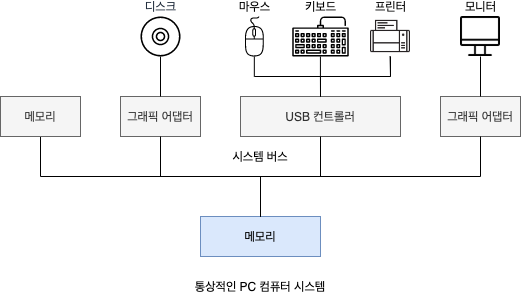
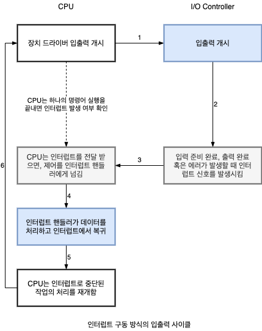

# 1. 서론

**운영체제**는 컴퓨터 하드웨어를 관리하는 소프트웨어입니다. 운영체제는 또한 응용 프로그램을 위한 기반을 제공하며 컴퓨터 사용자와 컴퓨터 하드웨어 사이에서 중재자 역할을 수행합니다.

## 1.1 운영체제가 할 일

컴퓨터 시스템은 대개 네 가지 구성요소인 하드웨어, 운영체제, 응용 프로그램 및 사용자로 구분할 수 있습니다.

- **하드웨어:** 중앙 처리 장치(CPU), 메모리 및 입출력(I/O) 장치로 구성되어 기본 계산용 자원을 제공
- **응용 프로그램:** 사용자의 계산 문제를 해결하기 위해 이들 자원이 어떻게 사용될지를 정의합니다.
- **운영체제:** 사용자를 위해 다양한 응용 프로그램 간의 하드웨어 사용을 제어하고 조정합니다.

또한 우리는 컴퓨터 시스템이 하드웨어, 소프트웨어 및 데이터로 구성되어 있다고 볼 수 있습니다. 운영 체제는 컴퓨터 시스템이 동작할 때 이들 자원을 적절하게 사용할 수 있는 방법을 제공합니다.

### 1.1.1 사용자 관점

컴퓨터에 대한 사용자의 관점은 사용되는 인터페이스에 따라 달라집니다.

### 1.1.2 시스템 관점

컴퓨터 시스템은 문제를 해결하기 위해 요구되는 여러 가지 자원들을 가집니다. 운영체제는 컴퓨터 시스템을 효율적이고 공정하게 운영할 수 있도록 어느 요청에 자원을 홯당할지 결정하는 **자원 할당자**(Resource Allocator)로서 동작합니다. 또한 컴퓨터의 부적절한 사용을 방지하기 위해 입출력 장치와 사용자 프로그램을 제어하는 **제어 프로그램**입니다.

### 1.1.3 운영체제의 정의

일반적으로 운영체제에 대한 적합한 정의는 없습니다. 운영체제는 유용한 컴퓨팅 시스템을 만들기 위한 합리적인 방법을 제공하기 때문에 존재합니다. 프로그램에 필요한 자원을 제어하고 할당하는 일반적인 기능들이 운영체제라는 하나의 소프트웨어로 통합됩니다.

운영체제에 포함되는 요소에 보편적인 정의는 없습니다. 포함되는 기능은 시스템마다 크게 다릅니다. 일반적으로 필요한 운영체제를 컴퓨터에서 실행하는 프로그램인 **커널**과 함께 두 가지 다른 유형의 프로그램이 포함됩니다. 운영체제와 관련되어 있지만 반드시 커널의 일부일 필요는 없는 **시스템 프로그램**과 시스템 작동과 관련되지 않은 모든 프로그램을 포함하는 **응용 프로그램**입니다.

개인용 컴퓨터가 널리 보급되고 운영체제가 점점 정교해짐에 따라 운영체제의 구성 용소가 무엇인지 점점 중요해 졌습니다. 1998년 Microsoft는 너무 많은 기능을 포함하여 응용 프로그램 공급 업체의 경쟁을 막았다고 유죄를 선고받았습니다. (에를 들어, 웹 브라우저는 Microsoft 운영체제의 필수 요소입니다.) 그러나 오늘날 모바일 기기의 운영체제를 살펴보면 운영체제를 구성하는 기능의 수가 다시 증가하고 있습니다. 모바일 운영체제에는 종종 핵심 커널뿐만 아니라 **미들웨어**(응용 프로그램 개발자에게 추가 서비스를 제공하는 일련의 소프트웨어 프레임 워크)도 포함됩니다.

## 1.2 컴퓨터 시스템의 구성

현대의 범용 컴퓨터 시스템은 하나 이상의 CPU와 구성요소와 공유 메모리 사이의 객세스를 제공하는 공통 **버스**를 통해 연결된 여러 장치 컨트롤러로 구성됩니다. 각 장치 컨트롤러는 특정 유형의 장치를 담당하고, 컨트롤러에 따라 둘 이상의 장치가 연결될 수도 있습니다. 장치 컨트롤러는 일부 로컬 버퍼 저장소와 특수 목적 레지스터 집합을 유지 관리하는데, 장치 컨트롤러는 버퍼 저장소와 제어하는 장치 간에 데이터를 이동합니다.

일반적으로 운영체제에는 각 장치 컨트롤러마다 **장치 드라이버**가 있습니다. 이 장치 드라이버는 장치 컨트롤러의 작동을 알고 있고 나머지 운영체제의 장치에 대한 인터페이스를 제공합니다. CPU와 장치 컨트롤러는 병렬로 실행되며, 메모리 사이클을 놓고 경쟁합니다. 공유 메모리를 질서 있게 액세스하기 위해 메모리 컨트롤러는 메모리에 대한 액세스를 동기화합니다.

### 1.2.1 인터럽트(Interrupts)

일반적인 컴퓨터 작업(입출력을 수행하는 프로그램)을 생각해봅니다.

1. 입출력 작업을 시작하기 위해 장치 드러이버는 장치 컨트롤러의 적절한 레지스터에 값을 적재해야 합니다.
2. 장치 컨트롤러는 이러한 레지스터의 내용을 검사하여 수행할 작업을(키보드에서 문자 읽기) 결정합니다.
3. 컨트롤러는 장치에서 로컬 버퍼로 데이터 전송을 시작합니다. 데이터 전송이 완료되면 장치 컨트롤러는 장치 드라이버에게 작업이 완료되었음을 알립니다.
4. 읽기 요청이면 장치 드라이버는 데이터 또는 데이터에 대한 포인터를 반환하며 운영체제의 다른 부분에 제어를 넘깁니다.
5. 다른 작업의 경우 장치 드라이버는 "쓰기 완료" 또는 "장치 사용 중"과 같은 상태 정보를 반환합니다.

컨트롤러는 장치 드라이버에게 작업을 완료했다는 사실을 어떻게 알릴까요? 이는 **인터럽트**를 통해 이루어집니다.

#### 1.2.1.1 개요

각 컴퓨터 설계는 자신의 인터럽트를 메커니즘으로 가지고 있으며, 몇 가지 기능은 공통적입니다.

- 인터럽트는 적절한 서비스 루티으로 제어를 전달합니다.
- 임터럽트 루틴은 반드시 명시적으로 현재의 상태를 저장해야 하며, 복귀하기 전에 그 상태를 복원해야 합니다.

#### 1.2.1.2 구현

장치 컨트롤러가 인터럽트 요청 라인에 신호를 선언하여 인터럽트를 **발생**(raise) 시키고, CPU는 인터럽트를 **포착**(catch)하여 인터럽트 핸들러로 **디스패치**(dispatch)하고 핸들러는 장치를 서비스하여 인터럽트를 **지웁니다**(clear). 기본 인터럽트 기법은 장치 컨트롤러가 서비스할 준비가 될 때와 같은 비동기 이벤트에 CPU가 대응할 수 있게 합니다. 그러나 최신 운영체제에서는 더욱 정겨한 인터럽트 처리 기능이 필요합니다. 최신 컴퓨터 하드웨어에서 다음 세 가지 기능을 CPU 및 **인터럽트 컨트롤러 하드웨어**에서 제공헙니다.

1. 중요한 처리 중에 인터럽트 처리를 연기할 수 있어야 합니다.
2. 장치의 적절한 인터럽트 핸들러로 효율적으로 디스패치 할 방법이 필요합니다.
3. 운영체제가 우선순위가 높은 인터럽트와 우선순위가 낮은 인터럽트를 구분하고 적절히 대응할 수 있도록 다단계 인터럽트가 필요합니다.

대배분의 CPU에는 2개의 인터럽트 요청 라인이 있습니다. 하나는 복구할 수 없는 메모리 오류와 같은 이벤트를 위해 예약된 **마스크 불가능 인터럽트**(Nonmaskable Interrupt)입니다. 두번째는 장치 컨트롤라가 서비스를 요청하기 위해 사용하는 **마스크 가능 인터럽트**(Maskable)입니다. 마스크 가능 인터럽트는 인터럽트 되어서는 안되는 중요한 명령 시퀀스를 실행하기 전에 CPU에 의해 꺼질 수 있습니다.

**백터 방식 인터럽트 기법**의 목적은 하나의 인터럽트 핸들러가 가능한 모든 인터럽트 소스를 검색할 필요를 줄이기 위함입니다. 그러나 실제로 컴퓨터에는 인터럽트 백터의 주소 개수보다 더 많은 장치(따라서 인터럽트 핸들러)가 있습니다. 이 문제를 해결하는 일반적인 방법은 **인터럽트 체인**을 사용하는 것입니다. 인터럽트 백터의 각 원소는 인터럽트 핸들러 리스트의 헤드를 가리킵니다. 인터럽트가 발생하면 요청을 처리할 수 있는 핸들러가 발견될 때까지 상응하는 리스트의 핸들러가 하나씩 호출됩니다. 이러한 구조느 ㄴ큰 크기의 인터럽트 테이블 오버헤드와 하나의 인터럽트 핸들러로 디스패치 하는 비효율성의 절충안입니다.

인터럽트 기법은 또한 인터럽트 **우선순위 레벨**(Interrupt Priority Level)을 구현합니다. 이러한 레벨을 통해 CPU는 모든 인터럽트를 마스킹하지 않고도 우선순위가 낮은 인터럽트 처리를 연기할 수 있습니다.
